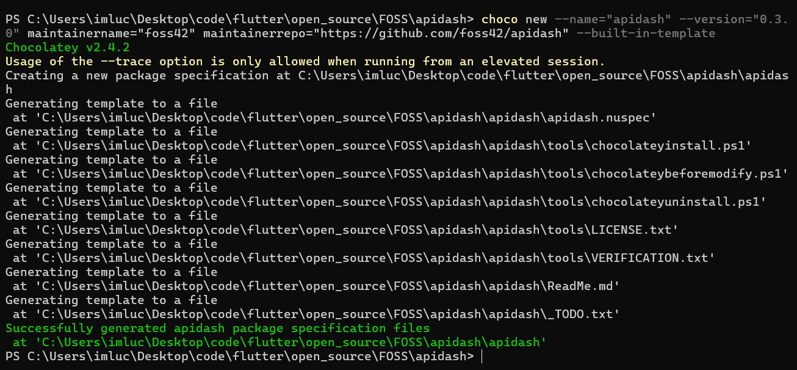
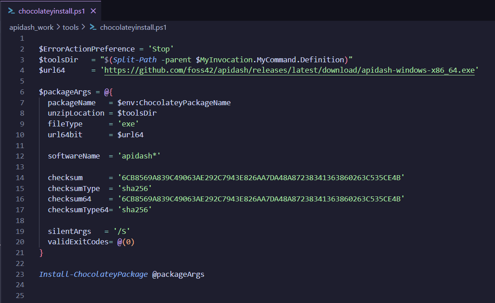
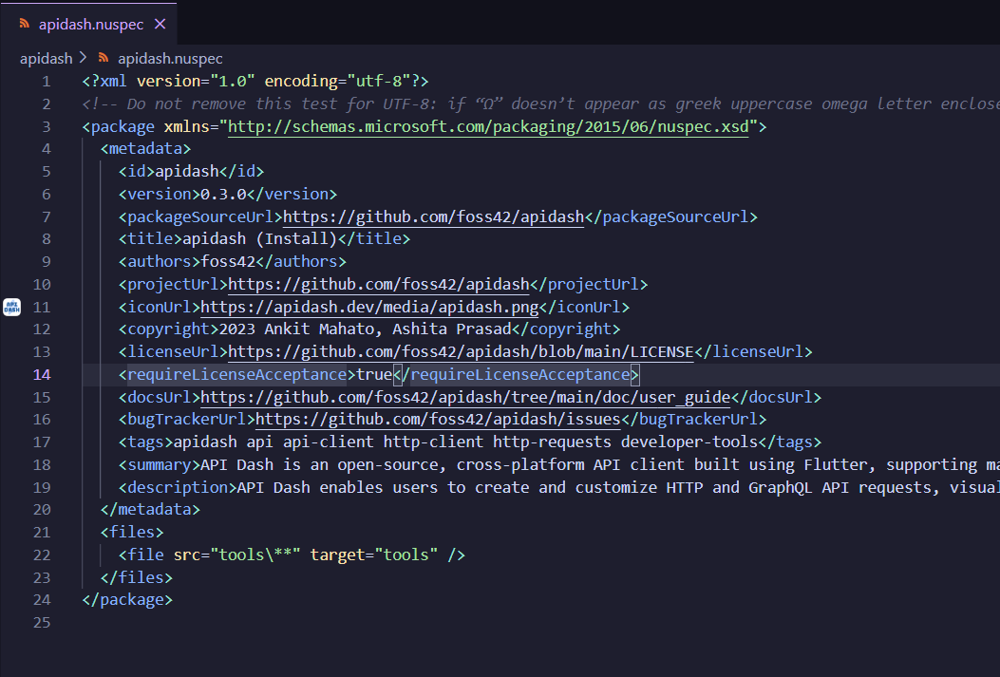
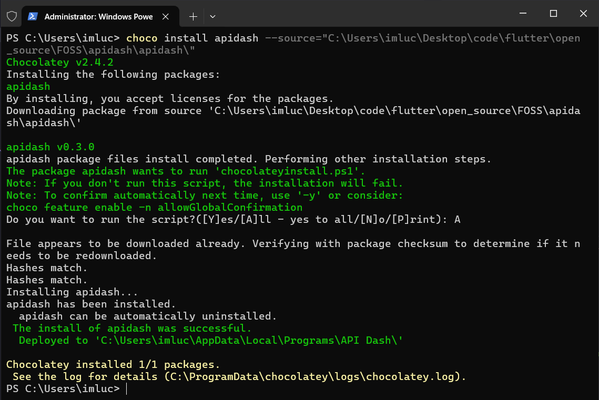

# Packaging API Dash

## Windows

[Packaging and Distributing Flutter Desktop Apps : Creating Windows .exe installer](https://medium.com/@fluttergems/packaging-and-distributing-flutter-desktop-apps-the-missing-guide-for-open-source-indie-0b468d5e9e70)

## macOS

[Packaging and Distributing Flutter Desktop Apps: Creating macOS .app & .dmg](https://medium.com/@fluttergems/packaging-and-distributing-flutter-desktop-apps-the-missing-guide-part-1-macos-b36438269285)

## Linux Debian (.deb) & RPM (.rpm)

[Packaging and Distributing Flutter Desktop Apps: Creating Linux Debian (.deb) & RPM (.rpm) builds](https://medium.com/@fluttergems/packaging-and-distributing-flutter-desktop-apps-the-missing-guide-for-open-source-indie-24ef8d30a5b4)

## Arch Linux (PKGBUILD)

TODO Instructions

## FlatHub (Flatpak)

TODO Instructions

## Homebrew

Homebrew Formula Submission

### 1. Prepare Tap Repository

```
# Create Homebrew tap
gh repo create homebrew-tap --public --clone
mkdir -p homebrew-tap/Formula
cd homebrew-tap
```

### 2. Package apidash

```
# Build macOS bundle
flutter build macos

# Create versioned tarball
tar -czvf apidash-v1.0.0.tar.gz \
  -C build/macos/Build/Products/Release/ \
  Apidash.app

# Generate SHA256 checksum
shasum -a 256 apidash-v1.0.0.tar.gz
```

### 3. Create Formula File

`Formula/apidash.rb`:

```
class Apidash < Formula
  desc "Modern API dashboard for developers"
  homepage "https://apidash.dev"
  url "https://github.com/<user>/<repo>/releases/download/v1.0.0/apidash-v1.0.0.tar.gz"
  sha256 "PASTE_YOUR_SHA256_HERE"

  def install
    prefix.install "Apidash.app"
    bin.write_exec_script prefix/"Apidash.app/Contents/MacOS/Apidash"
  end

  test do
    system "#{bin}/Apidash", "--version"
  end
end
```

### 4. Local Validation

```
# Check formula syntax
brew audit --strict Formula/apidash.rb

# Test installation
brew install --build-from-source Formula/apidash.rb

# Verify execution
brew test apidash
```

### 5. Custom Tap Submission

```
# Commit formula to your tap repo
git add Formula/Apidash.rb
git commit -m "added apidash formula"
git push

# Create release for tarball
gh release create v1.0.0 apidash-v1.0.0.tar.gz
```

### 6. Installation

```
brew tap homebrew-tap/Formula
brew install apidash
```

## Chocolatey

### Step 1: Setup Skeleton

First step towards making a choco package is initializing a base.

The command `choco new -h` can teach you more about the `new` command, its usage, options, switches, and exit codes.

Run the following command to setup the base

```powershell
choco new --name="apidash" --version="0.3.0" maintainername="foss42" maintainerrepo="https://github.com/foss42/apidash" --built-in-template
```



This creates the following folder structure

```
apidash
├── ReadMe.md
├── _TODO.txt
├── apidash.nuspec
└── tools
    ├── chocolateybeforemodify.ps1
    ├── chocolateyinstall.ps1
    ├── chocolateyuninstall.ps1
    ├── LICENSE.txt
    └── VERIFICATION.txt
```

The files `ReadMe.md` and `_TODO.md` can be deleted before pushing.

The files of our main interest are `chocolateyinstall.ps1` and `apidash.nuspec`.

### Step 2: Editing `chocolateyinstall.ps1`

Take a look at `chocolateyinstall.ps1` file. There are many comments stating the use case of each line itself.


Comments can bre remoed using the following command.
```powershell
$f='apidash\tools\chocolateyinstall.ps1'
gc $f | ? {$_ -notmatch "^\s*#"} | % {$_ -replace '(^.*?)\s*? [^``]#.*','$1'} | Out-File $f+".~" -en utf8; mv -fo $f+".~" $f
```

Now our `chocolateyinstall.ps1` file is ready.

### Step 3: Editing `apidash.nuspec`



### Step 4: Build the package

All our files are ready, we just need to pack out files in a choco package with the extension `.nupkg`.

Run the following command from the root of your directory:
```powershell
choco pack 
```
This command generates the `apidash.0.3.0.nupkg` file.

### Step 5: Test the Package Locally

Install the package locally using Chocolatey:
```powershell
choco install apidash -s .
```
Ensure the application installs correctly.



### Step 6: Pre-Publishing - Update `LICENSE.txt` & `VERIFICATION.txt`

Update `LICENSE.txt` with the actual **LICENSE **and `VERIFICATION.txt` accordingly.

### Step 7: Publish the Package (Optional)

To share the package, you can push it to a Chocolatey repository. For the official Chocolatey Community Repository, follow these steps:

1. Create an account on the Chocolatey Community.
2. Get an API key by navigating to your profile.
3. Use the following command to push your package:
```powershell
choco push apidash.0.3.0.nupkg --source="https://push.chocolatey.org/" --api-key="YOUR_API_KEY"
```

## WinGet

TODo Instructions
