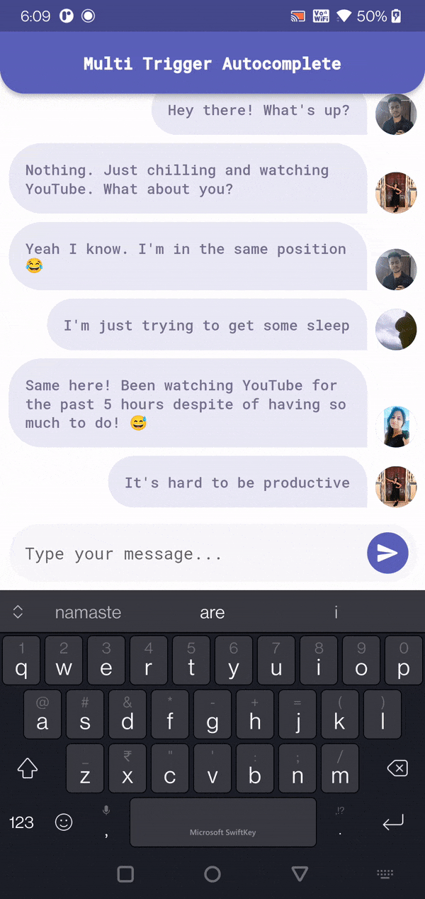

# multi_trigger_autocomplete_plus

> This is a fork from [multi_trigger_autocomplete](https://pub.dev/packages/multi_trigger_autocomplete)

A flutter widget to add trigger based autocomplete functionality to your app.

<p>
  
</p>

## Improvements

This fork includes the following improvements over the original package:

- **AutocompleteNoTrigger**: A Special trigger which allows allows autcomplete suggestions without a trigger character/string.
- **Enhanced Customization**: Allows customization of `triggerEnd` instead of using a hardcoded space (`' '`).
- **Prefix Triggers Handling**: Correctly identifies and handles triggers that share a common prefix, such as `{` and `{{`.

## Installation

Add the following to your `pubspec.yaml` and replace `[version]` with the latest version:

```yaml
dependencies:
  multi_trigger_autocomplete_plus: ^[version]
```

## Usage

To use this package you must first wrap your top most widget
with [Portal](https://pub.dev/documentation/flutter_portal/latest/flutter_portal/Portal-class.html) as this package
uses [flutter_portal](https://pub.dev/packages/flutter_portal)
to show the options view.

> `Portal`, is the equivalent of [Overlay].
>
> This widget will need to be inserted above the widget that needs to render
> _under_ your overlays.
>
> If you want to display your overlays on the top of _everything_, a good place
> to insert that `Portal` is above `MaterialApp`:
>
> ```dart
> Portal(
>   child: MaterialApp(
>     ...
>   )
> );
> ```
>
> (works for `CupertinoApp` too)
>
> This way `Portal` will render above everything. But you could place it
> somewhere else to change the clip behavior.

Import the package:

```dart
import 'package:multi_trigger_autocomplete_plus/multi_trigger_autocomplete.dart';
```

Use the widget:

```dart
MultiTriggerAutocomplete(
  optionsAlignment: OptionsAlignment.topStart,
  autocompleteTriggers: [
    // Add the triggers you want to use for autocomplete
    AutocompleteTrigger(
      trigger: '@',
      optionsViewBuilder: (context, autocompleteQuery, controller) {
        return MentionAutocompleteOptions(
          query: autocompleteQuery.query,
          onMentionUserTap: (user) {
            final autocomplete = MultiTriggerAutocomplete.of(context);
            return autocomplete.acceptAutocompleteOption(user.id);
          },
        );
      },
    ),
    AutocompleteTrigger(
      trigger: '#',
      optionsViewBuilder: (context, autocompleteQuery, controller) {
        return HashtagAutocompleteOptions(
          query: autocompleteQuery.query,
          onHashtagTap: (hashtag) {
            final autocomplete = MultiTriggerAutocomplete.of(context);
            return autocomplete
                .acceptAutocompleteOption(hashtag.name);
          },
        );
      },
    ),
    AutocompleteTrigger(
      trigger: ':',
      optionsViewBuilder: (context, autocompleteQuery, controller) {
        return EmojiAutocompleteOptions(
          query: autocompleteQuery.query,
          onEmojiTap: (emoji) {
            final autocomplete = MultiTriggerAutocomplete.of(context);
            return autocomplete.acceptAutocompleteOption(
              emoji.char,
              // Passing false as we don't want the trigger [:] to
              // get prefixed to the option in case of emoji.
              keepTrigger: false,
            );
          },
        );
      },
    ),
  ],
  // Add the text field widget you want to use for autocomplete
  fieldViewBuilder: (context, controller, focusNode) {
    return Padding(
      padding: const EdgeInsets.all(8.0),
      child: ChatMessageTextField(
        focusNode: focusNode,
        controller: controller,
      ),
    );
  },
),
```

## Demo

| Mention Autocomplete | Hashtag Autocomplete | Emoji Autocomplete |
| --- | --- | --- |
|  |  |  |

## Customization

### MultiTriggerAutocomplete

```dart
MultiTriggerAutocomplete(
  // Defines the autocomplete trigger that will be used to match the
  // text.
  autocompleteTriggers: autocompleteTriggers,

  // Defines the alignment of the options view relative to the
  // fieldView.
  //
  // By default, the options view is aligned to the bottom of the
  // fieldView.
  optionsAlignment: OptionsAlignment.topStart,

  // Defines the width to make the options as a multiple of the width
  // of the fieldView.
  //
  // Setting this to 1 makes the options view width matches the width
  // of the fieldView.
  //
  // Use null to remove this constraint.
  optionsWidthFactor: 1.0,

  // Defines the duration of the debounce period for the
  // [TextEditingController].
  //
  // This is the time between the last character typed and the matching
  // is performed.
  debounceDuration: const Duration(milliseconds: 350),

  // Defines the initial value to set in the internal
  // [TextEditingController].
  //
  // This value will be ignored if [TextEditingController] is provided.
  initialValue: const TextEditingValue(text: 'Hello'),

  // Defines the [TextEditingController] that will be used for the
  // fieldView.
  //
  // If this parameter is provided, then [focusNode] must also be
  // provided.
  textEditingController: TextEditingController(text: 'Hello'),

  // Defines the [FocusNode] that will be used for the fieldView.
  //
  // If this parameter is provided, then [textEditingController] must
  // also be provided.
  focusNode: FocusNode(),

  // Defines the fieldView that will be used to input the text.
  //
  // By default, a [TextFormField] is used.
  fieldViewBuilder: (context, controller, focusNode) {
    return TextField(
      controller: controller,
      focusNode: focusNode,
    );
  },
),
```

### AutocompleteTrigger

```dart
AutocompleteTrigger(
  // The trigger string/character that will be used to trigger the
  // autocomplete.
  trigger: '@',

  // The trigger end string/character that will be used to determine
  // the end of the trigger.
  // By default, it's a space.
  triggerEnd: ' ',

  // If true, the [trigger] should only be recognised at
  // the start of the input text.
  //
  // valid example: "@luke hello"
  // invalid example: "Hello @luke"
  triggerOnlyAtStart: false,

  // If true, the [trigger] should only be recognised after
  // a space.
  //
  // valid example: "@luke", "Hello @luke"
  // invalid example: "Hello@luke"
  triggerOnlyAfterSpace: true,

  // A minimum number of characters can be provided to only show
  // suggestions after the user has input enough characters.
  //
  // example:
  // "Hello @l" -> Shows zero suggestions.
  // "Hello @lu" -> Shows suggestions for @lu.
  minimumRequiredCharacters: 2,

  // The options view builder is used to build the options view
  // that will be shown when the [trigger] is detected.
  optionsViewBuilder: (context, autocompleteQuery, controller) {
    return MentionAutocompleteOptions(
      query: autocompleteQuery.query,
      onMentionUserTap: (user) {
        // Accept the autocomplete option.
        final autocomplete = MultiTriggerAutocomplete.of(context);
        return autocomplete.acceptAutocompleteOption(user.id);
      },
    );
  },
)
```

### AutocompleteNoTrigger

Can be used to display autocomplete suggestions without requiring a trigger string or character.

```dart
AutocompleteNoTrigger(
  // A minimum number of characters can be provided to only show
  // suggestions after the user has input enough characters.
  minimumRequiredCharacters: 2,

  // The options view builder is used to build the options view
  // that will be shown when the [trigger] is detected.
  optionsViewBuilder: (context, autocompleteQuery, controller) {
    return MentionAutocompleteOptions(
      query: autocompleteQuery.query,
      onMentionUserTap: (user) {
        // Accept the autocomplete option.
        final autocomplete = MultiTriggerAutocomplete.of(context);
        return autocomplete.acceptAutocompleteOption(user.id);

        // Handle field unfocusing manually using a FocusNode
        focusNode.unfocus();
      },
    );
  },
)
```

## License

This Repo - Apache-2.0  
Original Code - MIT License  
Check full [license](LICENSE).
